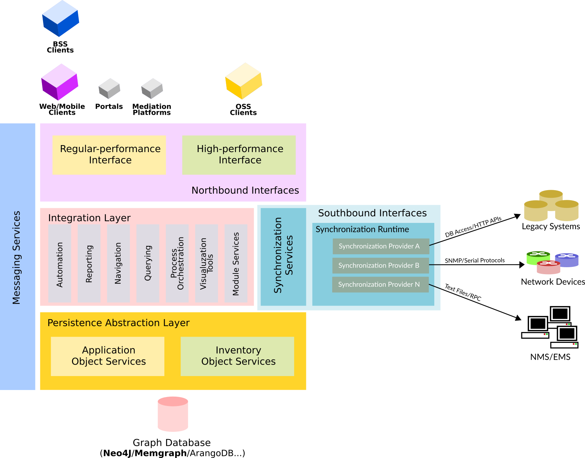
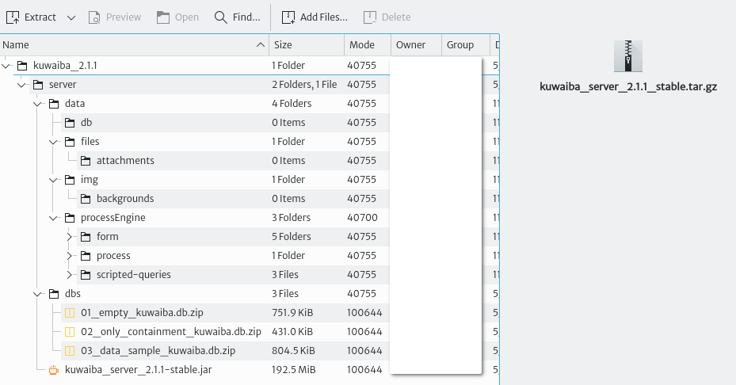

# Table of Contents
- [Table of Contents](#table-of-contents)
- [Introduction](#introduction)
- [Installation](#installation)
  - [Standalone](#standalone)
    - [Requirements](#requirements)
    - [Getting It Up and Running](#getting-it-up-and-running)
  - [Docker](#docker)
    - [Using an External Database](#using-an-external-database)
- [Troubleshooting](#troubleshooting)
- [Appendix A. Securing the Server](#appendix-a-securing-the-server)
  - [Recommendations](#recommendations)
- [Appendix B. Starting the Server on Boot](#appendix-b-starting-the-server-on-boot)
- [Appendix C. Accessing the Database](#appendix-c-accessing-the-database)
# Introduction
*This documentation applies to version **2.1.x***

**Kuwaiba** is an enterprise-ready network inventory platform geared towards the Telecommunications industry, but easily adaptable to other domains. It was designed to not only serve as an asset repository, but also to orchestrate complex business processes such as Service Provisioning, Activation, Modification and Termination, and to greatly speed the creation and integration of OSS (as in Operation Support Systems) applications. 

# Installation
## Standalone
### Requirements
* Java Development Kit 8 or 11 (recommended). Newer versions have not been tested and might not work.
* The server application bundle
* An initial database

### Getting It Up and Running
1. Download your preferred JDK flavor. We recommend [OpenJDK](https://www.openjdk.org) and it's available in most distro repositories, but if you are struggling to find the right version, the [Amazon binaries](https://docs.aws.amazon.com/corretto/latest/corretto-11-ug/downloads-list.html) (also known as Coretto). We will use Amazon's JDK as it is distro-agnostic (There are several other builds, including [Microsoft's](https://learn.microsoft.com/en-us/java/openjdk/) and [OpenLogic's](https://www.openlogic.com/openjdk-downloads)). Unzip the installation package and copy it to your preferred location.
2. Download the latest 2.1.x installation package from [SourceForge](https://sourceforge.net/projects/kuwaiba/files/Version%202.x/). Let's take a look at the contents:

   

3. 
## Docker
### Using an External Database
# Troubleshooting
# Appendix A. Securing the Server
## Recommendations
* Make sure the user running the server only has access to the data directories and has as little other privileges as possible. Also, disable its shell access as instructed in the [installation section](#installation).
* Install a firewall (ufw works pretty well) and restrict access to non-necessary ports.
* Disable SSH user/password authentication and favor key-based authentication.
# Appendix B. Starting the Server on Boot
# Appendix C. Accessing the Database
