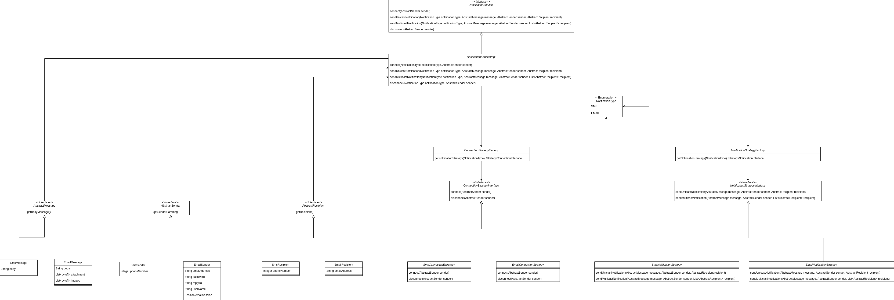

# Notifications Module

## Introduction
This module is designed to send notifications through various means, including email, text messages and instant messaging notifications, among others. To achieve this flexibility and efficiency, the module employs design patterns such as the strategy pattern and the factory pattern.
## Model

The following is the class diagram of the Kuwaiba integrated notification module.

- **NotificationService**. It includes generic methods that allow the user to connect, send notifications to one or more recipients and disconnect. This functionality is implemented in the **NotificationServiceImpl** class.
- **NotificationType**. Contains the types of notifications implemented. As an example, in the model the NotificationType class contains SMS or EMAIL, currently only e-mail notification is implemented.
- **AbstractSender**. It is an interface that contains the generic methods to be used by the classes that implement it. It contains the senders of the notifications.
    - **SmsSender**. Implements the AbstractSender interface for text message notification senders.
    - **EmailSender**. Implements the AbstractSender interface for email notification senders.
- **AbstractRecipient**. It is an interface that contains the generic methods to be used by the classes that implement it. It contains the receivers of the notifications.
    - **SmsRecipient**. Implements the AbstractRecipient interface for text message notification receivers.
    - **EmailRecipient**. Implements the AbstractRecipient interface for email message notification receivers.
- **AbstractMessage**. It is an interface that contains the generic methods to be used by the classes that implement it. It groups the different types of messages for the different types of notifications.
    - **SmsMessage**. Contains the attributes that the message of a notification sent by SMS can have.
    - **EmailMessage**. Contains the attributes that the message of a notification sent by email can have.
- **ConnectionStrategyFactory**. Contains the methods defining the type of connection to be established according to the NotificationType.
- **ConnectionStrategyInterface**. Interface that provides connection and disconnection methods to send notifications by different means.
    - **SmsConnectionEstrategy**. Implements the connection and disconnection methods provided by the ConnectionStrategyInterface specifically for SMS
    - **EmailConnectionEstrategy**. Implements the connection and disconnection methods provided by the ConnectionStrategyInterface specifically for email
- **NotificationStrategyFactory**. According to the NotificationType, check which notification strategy needs to be used.
- **NotificationStrategyInterface**. Contains generic notification sending methods.
    - **SmsNotificationStrategy**. Implements notification sending methods to be able to send a message via SMS
    - **EmailNotificationStrategy**. Implements notification sending methods to be able to send a message via email

